# Proyecto en Desarrollo WEB
# Plataforma para ver trailers de series y películas

<details>
	<summary></summary>

 **Tecnologías utilizadas**
<p align="center">
  
  
  
  
  
  
  
  
</p>

## Imágenes con Hipervínculos
	
[](https://chillstream.onrender.com)
[](https://chillstream.onrender.com/login)
[](https://chillstream.onrender.com)

</details>

# Proyectos en Bash

<details>

<summary></summary>
	
</details>


<details>
	<summary>Instalación</summary>
	
## Comando para instalar los Scripts
	
```bash
# Clonar el repositorio en la versión más actual
git clone --depth=1 https://github.com/luzardothomas/portfolio_luzardo_thomas.git
# Entrar al directorio donde se encuentra el instalador
cd portfolio_luzardo_thomas/linux_tools
# Ejecutar el instalador
bash installer.sh
```
## Opciones del Instalador
1. **Install:** Instala un script o todos a la vez.
2. **Uninstall:** Desinstala un script o todos a la vez.
3.  **Reinstall:** Reinstala todos los scripts a la vez.
4.  
</details>

	
<details>
	<summary>Testing</summary>
	
# Testing
Esta es una herramienta la cual ejecuta un lote de pruebas de cada script para mostrar su funcionamiento.
```bash
 # Entrar al directorio donde se encuentra el tester
 cd portfolio_luzardo_thomas/linux_tools/x_test_scripts/
 # Ejecutar el tester
 bash test_scripts.sh
```
## Opciones del Tester
1. **Test script:** Testea uno o todos los scripts a la vez.
2. **Regenerate test directories:** Elimina todos los directorios y recupera los test de los scripts copiandolos desde su directorio.
	
</details>	

<details>
	<summary>Scripts</summary>

<details>
	<summary>extract_directory_files</summary>

<details>
	<summary>Resumen</summary>
	
Extrae los archivos que se encuentran en los directorios, los almacena en un directorio y elimina los directorios vaciados.

</details>


<details>
	<summary>Sintaxis y parametros enviados</summary>
	
## Sintaxis

```
extract_directory_files ~/ruta comando_saltar nombre_directorio
```

## Parametros

* **Ruta (opcional):** La dirección que se mande tiene que incluir ~/* , dicho de otra forma /home/usuario/*. Si no se manda ninguna ruta entonces se utiliza la ruta del directorio actual en el que se encuentra.
* **Comando saltar (opcional):** Se utiliza para saltar la pregunta de seguridad que aparece luego de ejecutar el script.
* **Nombre directorio (obligatorio):** Es el nombre del directorio general donde se va a guardar el resultado de la extracción de archivos. No puede elegirse un nombre de directorio que ya exista dentro en la dirección en la que se ejecuta el Script.

| **⚠ Caracteres inválidos en el nombre del Directorio ⚠**  |
| ------------- |
| Nombre de Directorio vacío      | 
| Espacio      | 
| `/` Barra diagonal     |
|`\` Barra diagonal inversa|
|`:` Dos puntos|
|`*` Asterisco|
|`?` Signo de interrogación|
|`"` Comillas dobles|
|`<` Menor que|
|`>` Mayor que|
|`\|` Barra vertical|
    
</details>
	
<details>
	<summary>Funcionamiento</summary>

 1. Crea un directorio merge (nombre_directorio)
 2. Por orden ascendente va a recorrer los directorios que hay en la ruta mandada o en la que se encuentra
 3. Busca la ruta de todos los archivos con el comando "find"
 4. Mueve esos archivos al merge y luego borra el directorio que se recorrió
 5. El bucle se da en los pasos 2,3 y 4. El proceso finaliza cuando recorrió todos los directorios
	
</details>

<details>
	<summary>Ejemplo detallado de cómo funciona</summary>
	
#### Estado inicial

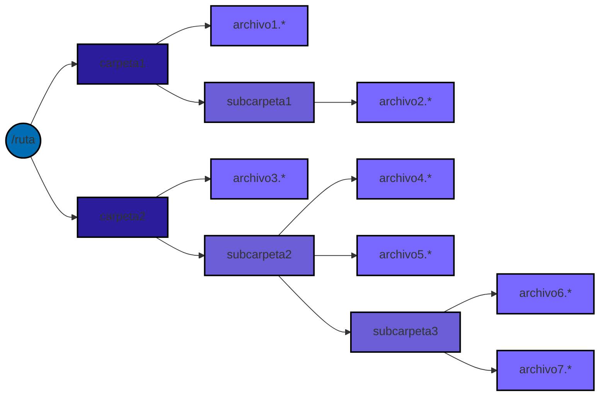


#### Estado final
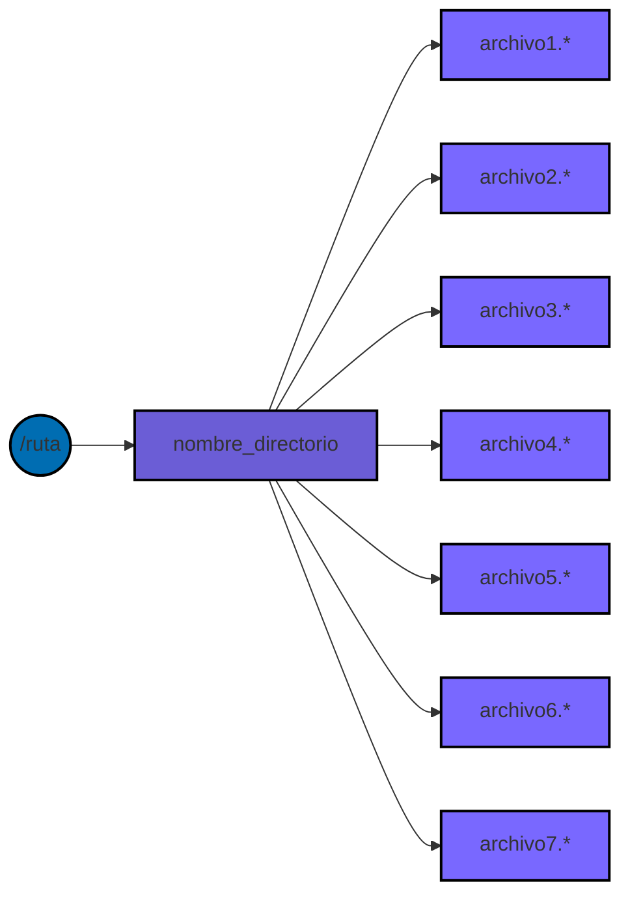

</details>


<details>
	<summary>Formas de usarlo</summary>

```bash
extract_directory_files ~/ruta nombre_directorio 
# los archivos obtenidos en la ruta guardan en nombre_directorio
```
```bash
extract_directory_files nombre_directorio 
# sin ruta especificada significa directorio actual
```
```bash
extract_directory_files -sk nombre_directorio 
# sk significa saltar pregunta
```
</details>
	
</details>

<details>
	<summary>rename_files</summary>

<details>
	<summary>Resumen</summary>

Renombra los archivos utilizando una plantilla.

</details>


<details>
	<summary>Sintaxis y parametros enviados</summary>
	
```
rename_files ~/ruta comando_saltar nombre_plantilla
```
* **Ruta (opcional):** La dirección que se mande tiene que incluir ~/* , dicho de otra forma /home/usuario/*. Si no se manda ninguna ruta entonces se utiliza la ruta del directorio actual en el que se encuentra.
* **Comando de saltar (opcional):** Se utiliza para saltar la pregunta que se da luego de ejecutar el script.
* **Nombre de la plantilla (obligatorio):** Es el nombre del directorio general (merge) en el que se va a guardar el resultado del renombramiento de los archivos. No se puede usar si ya existen archivos con esa plantilla.

| **⚠ Caracteres inválidos en el nombre del Directorio ⚠**  |
| ------------- |
| Nombre de Directorio vacío      | 
| Espacio      | 
| `/` Barra diagonal     |
|`\` Barra diagonal inversa|
|`:` Dos puntos|
|`*` Asterisco|
|`?` Signo de interrogación|
|`"` Comillas dobles|
|`<` Menor que|
|`>` Mayor que|
|`\|` Barra vertical|

</details>
	
<details>
	<summary>Funcionamiento</summary>


 1. Separa los archivos que va a recorrer en orden ascendente
 2. Inicializa un contador en 1
 3. Recorre los archivos en orden ascendente
 4. Obtiene la extensión del archivo
 5. El nombre nuevo del archivo va a tener como formato:
    * plantilla ; contador ; extensión
 6. Renombra el archivo con el nuevo nombre
 7. Le suma 1 al contador
 8. El bucle se da en los pasos 3,4,5, 6 y 7. El proceso finaliza cuando recorrió todos los archivos


</details>

<details>
	<summary>Ejemplo detallado de cómo funciona</summary>
	
#### Estado inicial

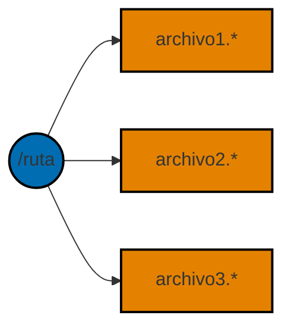


#### Estado final
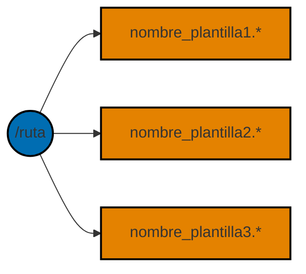

</details>


<details>
	<summary>Formas de usarlo</summary>

```bash
rename_files ~/ruta nombre_plantilla 
# los archivos obtenidos en la ruta guardan en nombre_directorio
```
```bash
rename_files nombre_plantilla  
# sin ruta especificada significa directorio actual
```
```bash
rename_files -sk nombre_plantilla  
# sk significa saltar pregunta
```

</details>

	
</details>


<details>
	<summary>smart_unzip</summary>

<details>
	<summary>Resumen</summary>

Extrae los archivos de cada archivo .zip, elimina el .zip original y almacena los archivos en un directorio.	

</details>


<details>
	<summary>Sintaxis y parametros enviados</summary>

```
smart_unzip ~/ruta comando_saltar nombre_directorio
```
* **Ruta (opcional):** La dirección que se mande tiene que incluir ~/* , dicho de otra forma /home/usuario/*. Si no se manda ninguna ruta entonces se utiliza la ruta del directorio actual en el que se encuentra.
* **Comando saltar (opcional):** Se utiliza para saltar la pregunta que se da luego de ejecutar el script.
* **Nombre directorio (obligatorio):** Directorio en el que se va a guardar el resultado de la extracción de archivos. No se puede crear si ya existe un directorio con el mismo nombre.

| **⚠ Caracteres inválidos en el nombre del Directorio ⚠**  |
| ------------- |
| Nombre de Directorio vacío      | 
| Espacio      | 
| `/` Barra diagonal     |
|`\` Barra diagonal inversa|
|`:` Dos puntos|
|`*` Asterisco|
|`?` Signo de interrogación|
|`"` Comillas dobles|
|`<` Menor que|
|`>` Mayor que|
|`\|` Barra vertical|	

</details>
	
<details>
	<summary>Funcionamiento</summary>


 1. Crea un directorio merge (nombre_directorio)
 2. Por orden ascendente va a recorrer los archivos .zip que hay en la ruta mandada o en la que se encuentra
 3. Extrae todos los archivos que se encuentran en el .zip en el merge
 4. Elimina el archivo .zip original
 5. El bucle se da en los pasos 2,3 y 4. El proceso finaliza cuando no hayan más archivos .zip

</details>

<details>
	<summary>Ejemplo detallado de cómo funciona</summary>

#### Estado inicial

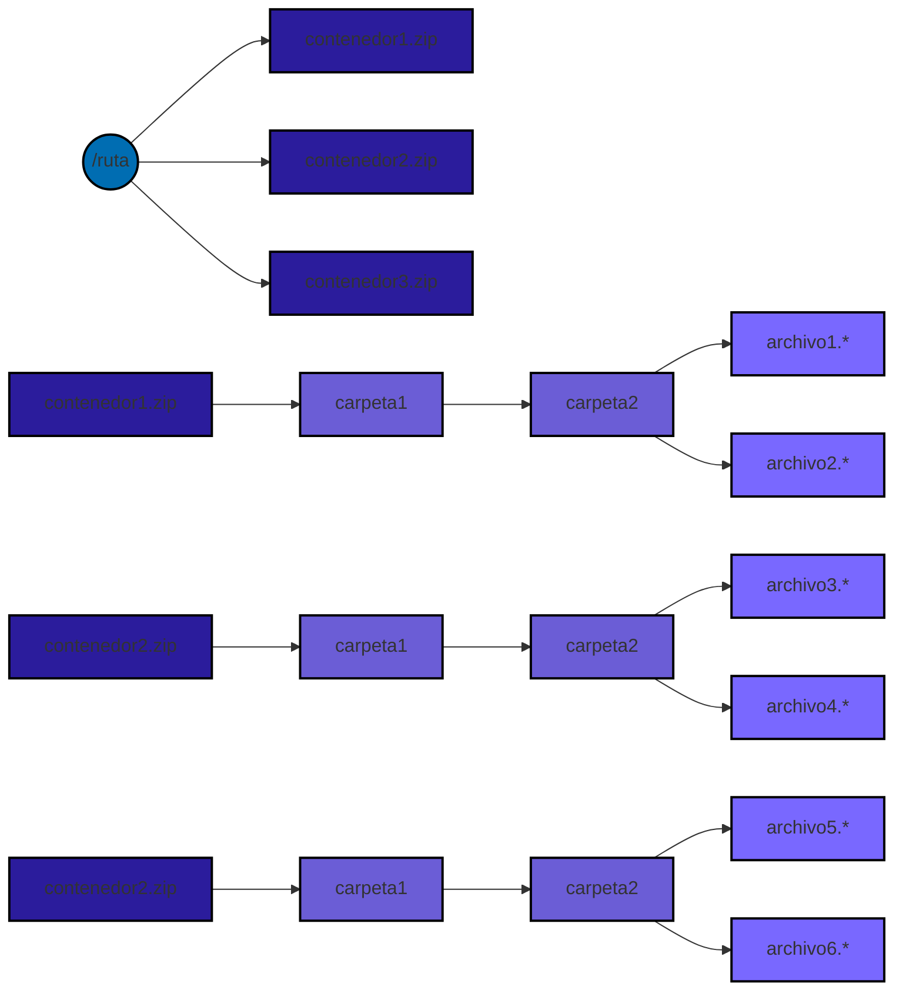


#### Estado final
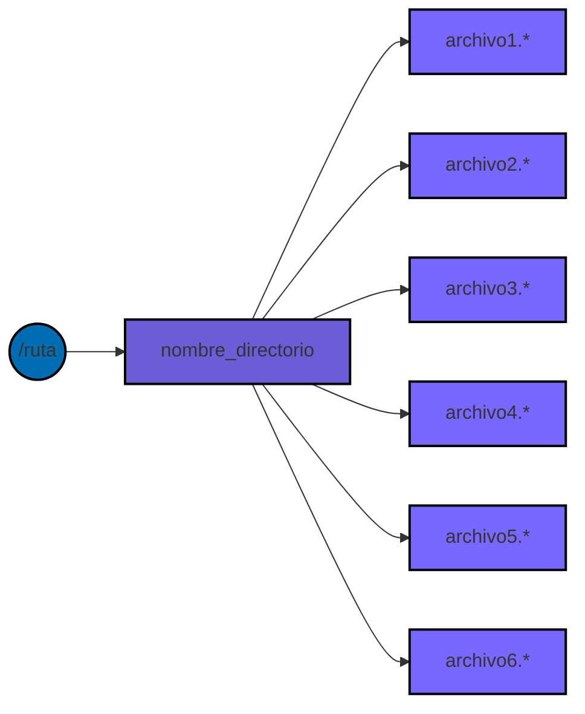
	
</details>


<details>
	<summary>Formas de usarlo</summary>

```bash
smart_unzip ~/ruta nombre_directorio 
# los archivos extraídos del .zip se guardan en el merge (nombre_directorio)
```
```bash
smart_unzip_files nombre_directorio 
# sin ruta especificada significa directorio actual
```
```bash
smart_unzip -sk nombre_directorio 
# sk significa saltar pregunta
```

</details>

</details>

<details>
	<summary>smart_zip</summary>


<details>
	<summary>Resumen</summary>

Comprime cada directorio en un archivo .zip, elimina el directorio original y almacena todos los .zip en un directorio.
	
</details>


<details>
	<summary>Sintaxis y parametros enviados</summary>

```bash
smart_zip ~/ruta comando_saltar nombre_directorio
```
* **Ruta (opcional):** La dirección que se mande tiene que incluir ~/* , dicho de otra forma /home/usuario/*. Si no se manda ninguna ruta entonces se utiliza la ruta del directorio actual en el que se encuentra.
* **Comando saltar (opcional):** Se utiliza para saltar la pregunta que se da luego de ejecutar el script.
* **Nombre directorio (obligatorio):** Directorio en el que se va a guardar el resultado de la compresión de archivos. No se puede crear si ya existe un directorio con el mismo nombre.

| **⚠ Caracteres inválidos en el nombre del Directorio ⚠**  |
| ------------- |
| Nombre de Directorio vacío      | 
| Espacio      | 
| `/` Barra diagonal     |
|`\` Barra diagonal inversa|
|`:` Dos puntos|
|`*` Asterisco|
|`?` Signo de interrogación|
|`"` Comillas dobles|
|`<` Menor que|
|`>` Mayor que|
|`\|` Barra vertical|	

</details>
	
<details>
	<summary>Funcionamiento</summary>

1. Crea un directorio merge
2. Por orden ascendente va a recorrer los directorios que hay en la ruta mandada o en la que se encuentra
3. Comprime un archivo a formato .zip
4. Se mueve el archivo .zip al merge
5. Elimina el directorio original
6. El bucle se da en los pasos 2,3 y 4. El proceso finaliza una vez que no hay más directorios

</details>

<details>
	<summary>Ejemplo detallado de cómo funciona</summary>

#### Estado inicial

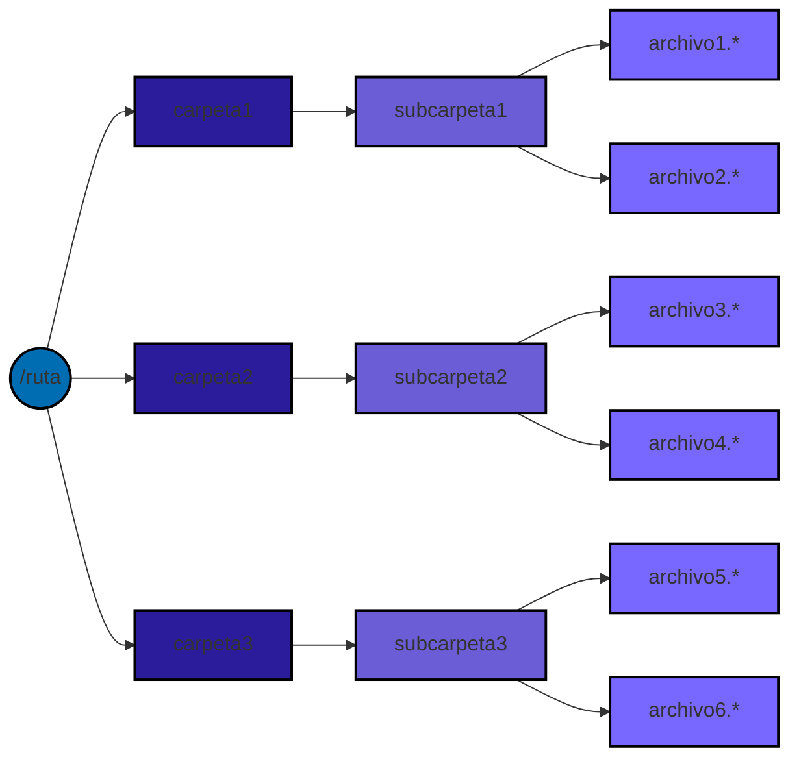


#### Estado final
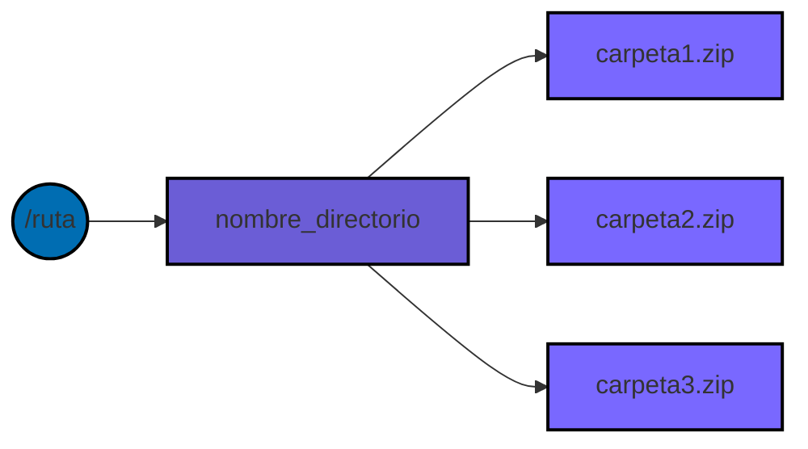

</details>


<details>
	<summary>Formas de usarlo</summary>

```bash
smart_zip ~/ruta nombre_directorio 
# los archivos obtenidos en la ruta guardan en nombre_directorio
```
```bash
smart_zip nombre_directorio 
# sin ruta especificada significa directorio actual
```
```bash
smart_zip -sk nombre_directorio 
# sk significa saltar pregunta
```

</details>
	
</details>


<details>
	<summary>wrap_files</summary>


<details>
	<summary>Resumen</summary>

Crea un directorio para cada archivo, almacena ese archivo en el directorio creado con su mismo nombre, y almacena esos directorios en un directorio.
	
</details>


<details>
	<summary>Sintaxis y parametros enviados</summary>

```
wrap_files ~/ruta comando_saltar nombre_directorio
```
* **Ruta (opcional):** La dirección que se mande tiene que incluir ~/* , dicho de otra forma /home/usuario/*. Si no se manda ninguna ruta entonces se utiliza la ruta del directorio actual en el que se encuentra.
* **Comando saltar (opcional):** Se utiliza para saltar la pregunta que se da luego de ejecutar el script.
* **Nombre directorio (obligatorio):** Es el nombre del directorio general (merge) en el que se va a guardar el resultado de la creación de directorios para cada archivo. Los directorios se llaman igual que el archivo que contienen. No se puede crear si ya existe un directorio con el mismo nombre.

| **⚠ Caracteres inválidos en el nombre del Directorio ⚠**  |
| ------------- |
| Nombre de Directorio vacío      | 
| Espacio      | 
| `/` Barra diagonal     |
|`\` Barra diagonal inversa|
|`:` Dos puntos|
|`*` Asterisco|
|`?` Signo de interrogación|
|`"` Comillas dobles|
|`<` Menor que|
|`>` Mayor que|
|`\|` Barra vertical|	

</details>
	
<details>
	<summary>Funcionamiento</summary>

 1. Crea un directorio merge (nombre_directorio).
 2. Por orden ascendente va a recorrer los archivos que hay en la ruta mandada o en la que se encuentra
 3. Crea un directorio para el archivo
 4. Mueve el archivo a su correspondiente directorio
 5. Mueve el directorio del archivo al merge
 6. El bucle se da en los pasos 2,3, 4 y 5. El proceso finaliza una vez que no hay más archivos


</details>

<details>
	<summary>Ejemplo detallado de cómo funciona</summary>


#### Estado inicial

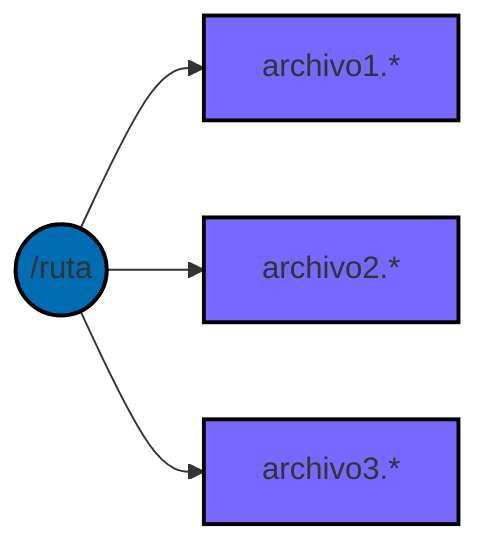


#### Estado final
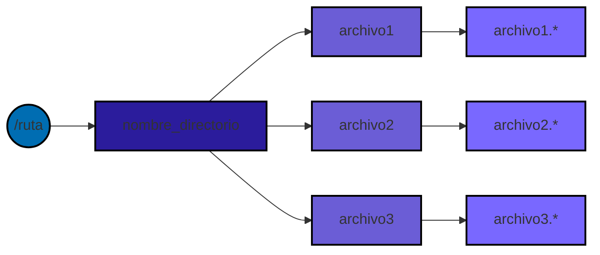
	

</details>


<details>
	<summary>Formas de usarlo</summary>

```bash
wrap_files ~/ruta nombre_directorio 
# los archivos obtenidos en la ruta guardan en nombre_directorio
```
```bash
wrap_files directory_name 
# sin ruta especificada significa directorio actual
```
```bash
wrap_files -sk directory_name 
# sk significa saltar pregunta
```

</details>


	
</details>


<details>
	<summary>wrap_files_in_groups</summary>

<details>
	<summary>Resumen</summary>

Almacena un grupo o varios grupos de archivos en uno o varios directorios.
	
</details>


<details>
	<summary>Sintaxis y parametros enviados</summary>

```
wrap_files_in_groups ~/ruta comando_saltar nombre_grupo rango
```
* **Ruta (opcional):** La dirección que se mande debe incluir ~/* , dicho de otra forma /home/usuario/*. Si no se manda ninguna ruta entonces se utiliza la ruta del directorio actual si es que cumple la condición anterior.

* **Comando saltar (opcional):** Se utiliza para saltar la pregunta y elegir la opción 1 o 2.
* **Nombre grupo (opcional):** Si no se manda el nombre del grupo previamente se lo va a pedir después. Es un directorio o muchos que almacenan una cantidad de archivos acorde al rango establecido. No se puede crear si ya existe un directorio con el mismo nombre que el grupo.
* **Rango (obligatorio):** Formato a-b (ambos números) que sirve para indicar cuántos archivos se quiere seleccionar. Si se pone 1-10 el rango se calcula con la diferencia del extremo superior y el inferior sumándole uno (10-1+1), por lo que seleccionaría los 10 primeros archivos que se encuentren en el orden ascendente. No se aceptan rangos negativos.

| **⚠ Caracteres inválidos en el nombre del Directorio ⚠**  |
| ------------- |
| Nombre de Directorio vacío      | 
| Espacio      | 
| `/` Barra diagonal     |
|`\` Barra diagonal inversa|
|`:` Dos puntos|
|`*` Asterisco|
|`?` Signo de interrogación|
|`"` Comillas dobles|
|`<` Menor que|
|`>` Mayor que|
|`\|` Barra vertical|
	

</details>
	
<details>
	<summary>Funcionamiento</summary>

 1. Separa los archivos en orden ascendente
 2. Inicializa un contador en 0
 3. Selecciona un rango de archivos
 4. Le suma 1 al contador
 5. Crea el directorio para un grupo de archivos
 6. Se mueve el rango de archivos a su grupo correspondiente
 7. El bucle se da en los pasos 3,4,5 y 6. El proceso finaliza cuando ya no hay más rangos

</details>

<details>
	<summary>Ejemplo 1 detallado de cómo funciona</summary>

#### Estado inicial

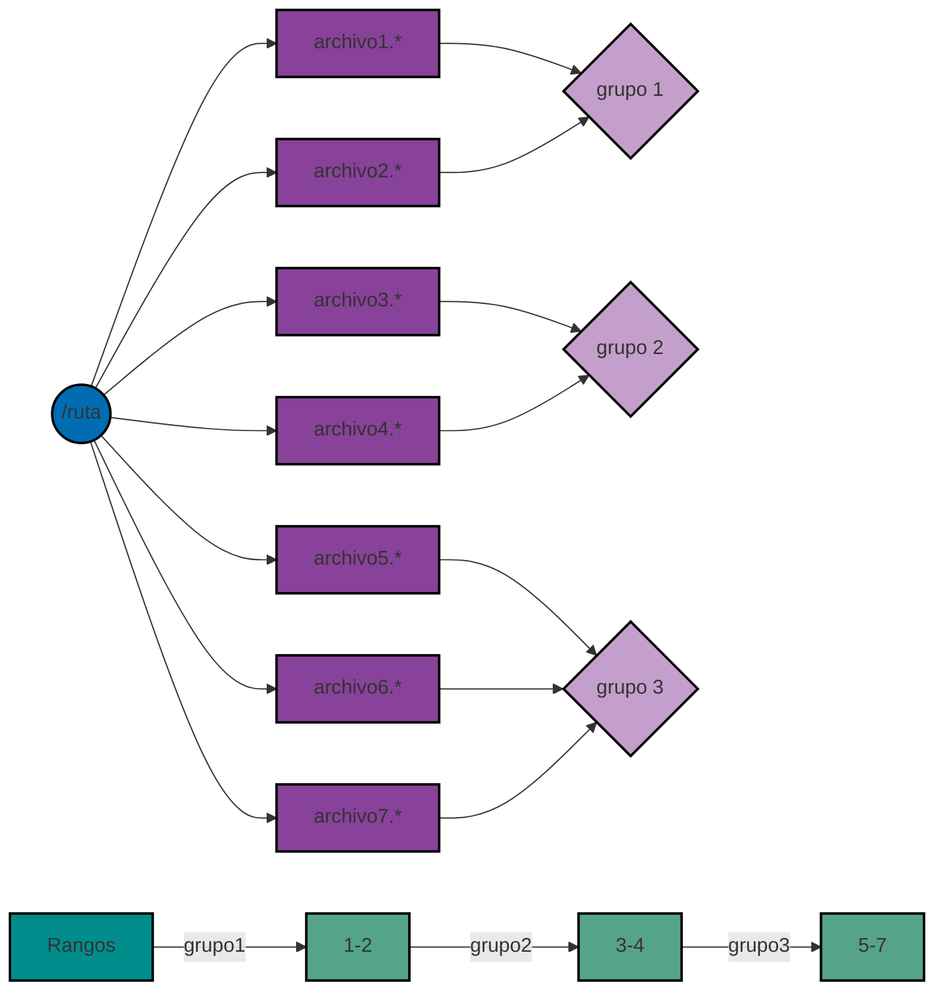


#### Estado final

	

</details>

<details>
	<summary>Ejemplo 2 detallado de cómo funciona</summary>


#### Estado inicial


#### Estado final
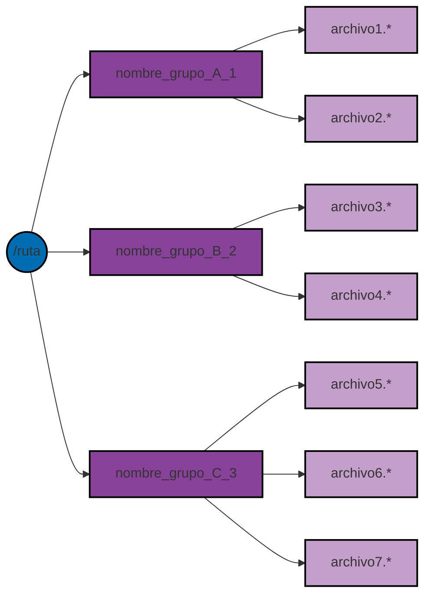

</details>


<details>
	<summary>Formas de usarlo</summary>

```bash
wrap_files_in_groups ~/ruta 1-10
# selecciona un grupo de 10 archivos y luego le toca al usuario decidir entre opcion 1 o 2
# opción 1 : nombre_plantilla | opción 2: nombre_grupo (como es solo un grupo da igual)
```
```bash
wrap_files_in_groups 1-10
# sin ruta especificada significa directorio actual
```
```bash
wrap_files_in_groups -sk1 1-2 3-6 7-10
# sk1 significa saltar pregunta y elegir opción 1
# la plantilla es solo una y la va a pedir por pantalla
# ejemplo: plantilla = nombre_ejemplo, son 3 grupos (1-2,3-6,7-10)
# nombre_ejemplo_1: 2 archivos, nombre_ejemplo_2: 4 archivos, nombre_ejemplo_3: 4 archivos
```
```bash
wrap_files_in_groups -sk1 nombre_grupo 1-2 3-6 7-10
# la plantilla es solo una y ya fue mandada previamente
# nombre_grupo_1: 2 archivos, nombre_grupo_2: 4 archivos, nombre_grupo_3: 4 archivos
```
```bash
wrap_files_in_groups -sk2 1-2 3-6 7-10
# sk2 significa saltar pregunta y elegir opción 2
# usar nombre_grupo como nombres especificos para grupos y se pide por pantalla
# ejemplo: son 3 grupos (1-2,3-6,7-10) por lo que habra que escribir tres nombre_grupo
# nombre_grupo_1 = grupoA, nombre_grupo_2 = grupoB, nombre_grupo_3 = grupoC
# grupoA_1: 2 archivos, grupoB_2: 4 archivos, grupoC_3: 4 archivos
```
```bash
wrap_files_in_groups -sk2 nombre_grupo_A nombre_grupo_B nombre_grupo_C 1-2 3-6 7-10
# se pe mandaron previamente cada uno de los nombres especificos para grupos
# cantidad de nombre_grupo = cantidad de grupos (cada rango es un grupo)
# nombre_grupo_A_1: 2 archivos, nombre_grupo_B_2: 4 archivos, nombre_grupo_C_3: 4 archivos
```

</details>


	
</details>


</details>


